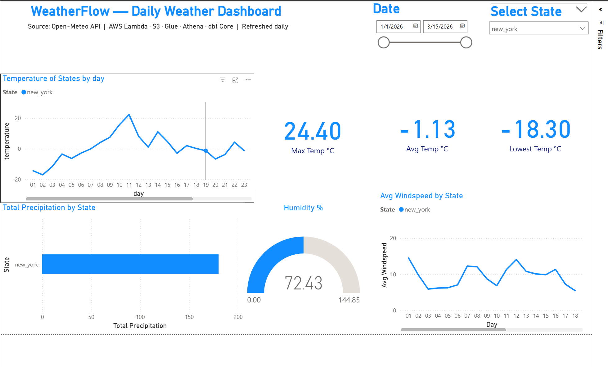
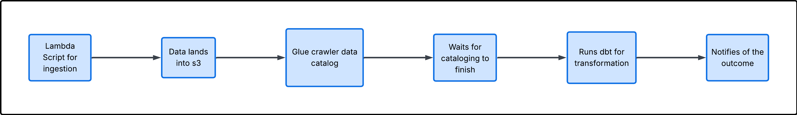
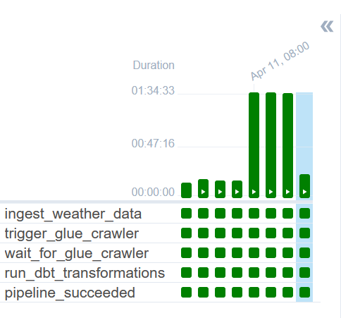

# WeatherFlow — Serverless ELT Weather Pipeline 🌤️

A fully automated, serverless ELT pipeline on AWS that ingests daily historical weather data for 3 US cities, transforms it into analytics-ready tables via Apache Airflow orchestration, and visualizes it in a Power BI dashboard — running daily without manual intervention.

---

## Dashboard

Built with Power BI Desktop connected to AWS Athena via ODBC. Displays daily weather metrics for New York, Los Angeles, and Chicago with interactive city and date range filters.



---

## Architecture

```
Open-Meteo Archive API (free, no key needed)
        ↓
Apache Airflow DAG (orchestration)
        ↓
AWS Lambda (ingestion script)
        ↓
Amazon S3 (raw data lake — Hive-style partitioning)
  raw/weather/city=new_york/year=2026/month=03/day=11/data.json
        ↓
AWS Glue Crawler (schema detection + partition registration)
        ↓
AWS Glue Data Catalog (meteo_raw database)
        ↓
Amazon Athena (queryable raw tables)
        ↓
dbt Core (transformation + data quality tests)
  staging layer → flattens nested JSON hourly arrays
  curated layer → daily aggregations per city
        ↓
Amazon Athena (clean analytics-ready tables)
        ↓
Power BI (live dashboard via ODBC)
```

---

## DAG Pipeline Flow



The Airflow DAG orchestrates every step in sequence — each task only runs if the previous one succeeds:

| Task | Operator | What it does |
|---|---|---|
| `ingest_weather_data` | LambdaInvokeFunctionOperator | Fetches yesterday's weather from Open-Meteo Archive API and uploads raw JSON to S3 |
| `trigger_glue_crawler` | GlueCrawlerOperator | Starts Glue Crawler to scan new S3 partitions |
| `wait_for_glue_crawler` | GlueCrawlerSensor | Polls every 60 seconds until crawler finishes |
| `run_dbt_transformations` | BashOperator | Runs `dbt run` + `dbt test` — transforms and validates data |
| `pipeline_succeeded` | BashOperator | Logs successful completion with timestamp |

---

## Airflow Execution — All Tasks Green



All 5 tasks running successfully with automatic retry logic, task dependency management, and sensor-based polling.

---

## Automation

```
8:00am UTC  → Airflow triggers Lambda → yesterday's completed data lands in S3
             → Glue Crawler runs → new partitions registered in Data Catalog
             → dbt run + dbt test → curated tables refreshed and validated
             → Power BI reflects updated data via live Athena ODBC connection
             → CloudWatch monitors Lambda errors
             → SNS email alert if pipeline fails at any step
```

---

## Tech Stack

| Layer | Tool |
|---|---|
| Orchestration | Apache Airflow (Docker Compose), AWS EventBridge |
| Ingestion | Python, AWS Lambda, boto3 |
| Storage | Amazon S3 (Hive-style partitioned data lake) |
| Cataloging | AWS Glue Crawler, Glue Data Catalog |
| Querying | Amazon Athena |
| Transformation | dbt Core, dbt-athena-community |
| Data Quality | dbt tests (not_null, accepted_values, schema integrity) |
| Monitoring | AWS CloudWatch, Amazon SNS |
| Visualization | Power BI Desktop (live Athena ODBC connection) |
| Containerization | Docker, Docker Compose |
| CI/CD | GitHub Actions |
| Version Control | Git, GitHub |

---

## Project Structure

```
weatherflow/
├── .github/
│   └── workflows/
│       └── dbt_run.yml              # GitHub Actions CI/CD (backup orchestration)
├── ingestion/
│   ├── lambda_function.py           # Lambda ingestion script
│   ├── backfill.py                  # Historical backfill script
│   └── requirements.txt
├── transformation/
│   └── meteo_elt/
│       ├── dbt_project.yml
│       ├── models/
│       │   ├── sources.yml          # Source declarations + data quality tests
│       │   ├── staging/
│       │   │   └── stg_weather.sql  # Flattens nested JSON hourly arrays
│       │   └── marts/
│       │       └── mart_daily_weather.sql  # Daily aggregations per city
│       └── macros/
│           └── generate_schema_name.sql    # Custom schema routing macro
├── airflow/
│   ├── dags/
│   │   └── weatherflow_pipeline.py  # Main Airflow DAG
│   ├── dbt/                         # dbt project mounted into Airflow container
│   ├── Dockerfile                   # Custom Airflow image with AWS + dbt
│   ├── docker-compose.yaml
│   └── .env.example                 # Environment variable template
└── assets/
    └── dashboard.png
```

---

## Data Flow

### Extract
Lambda calls the [Open-Meteo Archive API](https://archive-api.open-meteo.com/v1/archive) — free, no API key required. Fetches **yesterday's completed historical data** for 3 US cities:
- New York (40.7128°N, 74.0060°W)
- Los Angeles (34.0522°N, 118.2437°W)
- Chicago (41.8781°N, 87.6298°W)

### Variables pulled per city per hour:
| Variable | Description |
|---|---|
| `temperature_2m` | Air temperature at 2m height (°C) |
| `relative_humidity_2m` | Humidity percentage |
| `precipitation` | Rain/snow in mm |
| `wind_speed_10m` | Wind speed at 10m height (km/h) |
| `weather_code` | WMO weather condition code |

### Load
Raw JSON landed into S3 with Hive-style partitioning:
```
s3://meteo-elt-project/raw/weather/
  city=new_york/year=2026/month=03/day=11/data.json
  city=chicago/year=2026/month=03/day=11/data.json
  city=los_angeles/year=2026/month=03/day=11/data.json
```

### Transform (dbt)

**Staging layer** (`stg.stg_weather`) — materialized as view:
- Unnests hourly arrays using `CROSS JOIN UNNEST(sequence(1, 24))`
- Flattens 3 nested city rows → 72 flat rows (1 per city per hour)
- Renames raw API fields to clean column names

**Curated layer** (`curated.mart_daily_weather`) — materialized as table:
- Aggregates 72 hourly rows into 3 daily summary rows (one per city)
- Columns: `avg_temp_c`, `max_temp_c`, `min_temp_c`, `avg_humidity_pct`, `total_precipitation_mm`, `avg_wind_speed_kmh`

---

## dbt Model Lineage

```
[source: meteo_raw.weather]     ← raw S3 JSON via Glue Data Catalog
        ↓
[stg_weather]                   ← view in stg schema (72 hourly flat rows/day)
        ↓
[mart_daily_weather]            ← table in curated schema (3 daily rows/day)
```

---

## Data Quality — 15 Automated Tests

dbt runs 15 tests on every pipeline execution. Pipeline halts and alerts if any test fails:

```
✅ accepted_values: city must be new_york, los_angeles, or chicago (staging + mart)
✅ not_null: temperature_c, humidity_pct, precipitation_mm, wind_speed_kmh, weather_code
✅ not_null: hour_timestamp, city (staging layer)
✅ not_null: avg_temp_c, total_precipitation_mm, city (mart layer)
✅ not_null: latitude, longitude, hourly arrays (source layer)
```

---

## AWS Services & Cost

| Service | Usage | Cost |
|---|---|---|
| S3 | Raw JSON storage (~few MB/day) | Free tier |
| Lambda | 1 invocation/day, ~30 seconds | Free tier |
| Glue Crawler | 1 run/day | Free tier |
| Athena | Few KB scanned per query | Free tier |
| CloudWatch | 1 alarm | Free tier |
| SNS | Email on failure only | Free tier |
| **Total** | | **$0/month** |

---

## Local Setup

### Prerequisites
- Docker Desktop installed
- AWS account with IAM user credentials
- AWS resources deployed (Lambda, S3, Glue, Athena)

### Run Airflow locally

```bash
# clone repo
git clone https://github.com/SaiemAmin/WeatherFlow-ELT.git
cd WeatherFlow-ELT/airflow

# create .env file
cp .env.example .env
# fill in your AWS credentials in .env

# initialise and start Airflow
docker-compose up airflow-init
docker-compose up -d

# open Airflow UI at http://localhost:8080
# username: airflow / password: airflow
```

### Configure AWS connection in Airflow UI
```
Admin → Connections → aws_default → Edit
  AWS Access Key ID:     your_access_key
  AWS Secret Access Key: your_secret_key
  Extra: {"region_name": "eu-north-1"}
```

### Run historical backfill

```bash
pip install requests boto3
python ingestion/backfill.py
# fetches Jan 1 2026 → yesterday for all 3 cities (~75 days)
```

### Run dbt locally

```bash
pip install dbt-athena-community
cd transformation/meteo_elt
dbt debug    # test connection
dbt run      # run all models
dbt test     # run 15 data quality tests
```

---

## Sample Analytics Queries

**Average temperature per city:**
```sql
SELECT city, ROUND(AVG(avg_temp_c), 2) AS overall_avg_temp_c
FROM curated.mart_daily_weather
GROUP BY city
ORDER BY overall_avg_temp_c DESC;
```

**Total rainfall per city this month:**
```sql
SELECT city, SUM(total_precipitation_mm) AS total_precip_mm
FROM curated.mart_daily_weather
WHERE year = '2026' AND month = '03'
GROUP BY city
ORDER BY total_precip_mm DESC;
```

**Coldest day recorded:**
```sql
SELECT city, year, month, day, min_temp_c
FROM curated.mart_daily_weather
ORDER BY min_temp_c ASC
LIMIT 1;
```

**Windiest city on average:**
```sql
SELECT city, ROUND(AVG(avg_wind_speed_kmh), 2) AS avg_wind
FROM curated.mart_daily_weather
GROUP BY city
ORDER BY avg_wind DESC;
```

---

## Key Concepts Demonstrated

- **ELT pattern** — raw data loaded first, transformed after landing in S3
- **Medallion architecture** — raw → staging → curated layers
- **Airflow DAG orchestration** — task dependencies, retry logic, GlueCrawlerSensor
- **Serverless ingestion** — Lambda + EventBridge, zero server management
- **Hive-style S3 partitioning** — enables Athena partition pruning for cost efficiency
- **Glue Crawler automation** — automatic schema detection and partition registration
- **dbt Core transformations** — SQL models version controlled in git
- **Data quality testing** — 15 automated dbt tests enforced on every run
- **Docker containerization** — Airflow runs consistently across environments
- **Live BI connectivity** — Power BI connected to Athena via ODBC
- **CI/CD for data** — GitHub Actions as backup orchestration layer

---

## What I Learned

This project covers every stage of the data engineering lifecycle as described in *Fundamentals of Data Engineering* by Joe Reis:

- **Source systems** → REST API ingestion from Open-Meteo Archive API
- **Storage** → S3 data lake with Hive-style partitioning strategy
- **Ingestion** → batch ingestion of completed historical data, scheduled daily
- **Transformation** → ELT with dbt Core, staging and mart layers
- **Orchestration** → Apache Airflow DAGs with task dependencies, retries, and sensors
- **Serving** → Athena SQL for analytics + Power BI dashboard via ODBC
- **Undercurrents** → IAM security, CloudWatch monitoring, SNS alerting, Docker containerization
